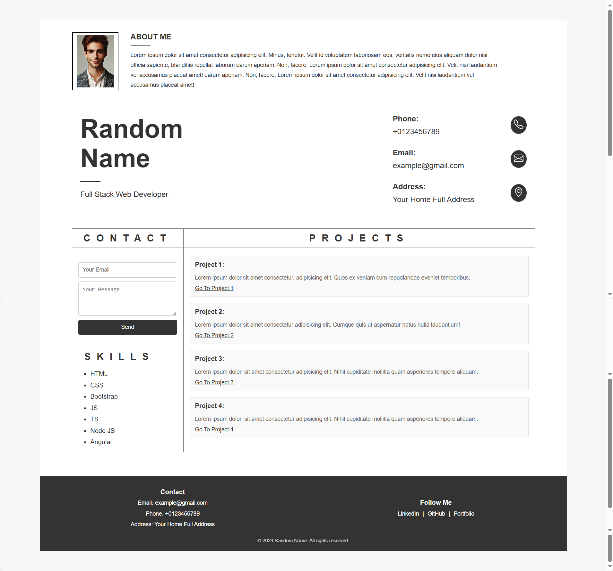

# Personal CV Website

This project is a simple personal CV website built with HTML and CSS. It presents a clean layout to showcase your profile, contact information, skills, projects, and social media links.

## Features

- **About Me Section**: Displays an image and a short description.
- **Header Section**: Includes the name, profession, and contact information (phone, email, and address).
- **Skills Section**: Displays a list of skills.
- **Projects Section**: Includes links to personal projects.
- **Contact Form**: Allows visitors to send messages.
- **Footer Section**: Includes contact information and links to social media.
  
## Project Structure

- **HTML**: The website's structure is written in HTML5.
- **CSS**: The styles are written in external CSS to keep the structure and styling separated.

### HTML Overview

The HTML file contains various sections:

**1. Document Declaration and Metadata**

**2. Body of the Document**
* Container: The entire content is wrapped inside a div with the class container.

**3. About Section**
* Image: Contains an image of the user with the id="about-img".
* Text: Includes a brief description about the person under the id="about-text".

**4. Header Section**
* Name and Role: Displays the user's name and job title under id="name".
* Contact Info: Contains a set of contact details (Phone, Email, Address)

**5. Table Section**
* Table Structure: A table contains two main columns: "CONTACT" and "PROJECTS".
* Contact Form: In the "CONTACT" column, there’s a form for users to enter their email and message, along with a submit button.
* Skills: A list of technical skills.
* Projects: In the "PROJECTS" column, it lists several projects with brief descriptions and links.

**6. Footer Section**
* Contact Details: it shows contact information like email, phone, and address.
* Social Links: Links to LinkedIn, GitHub, and the Portfolio.
* Footer Bottom: Displays a copyright notice.